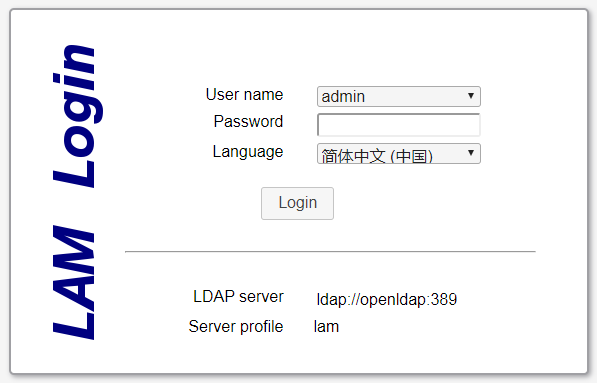
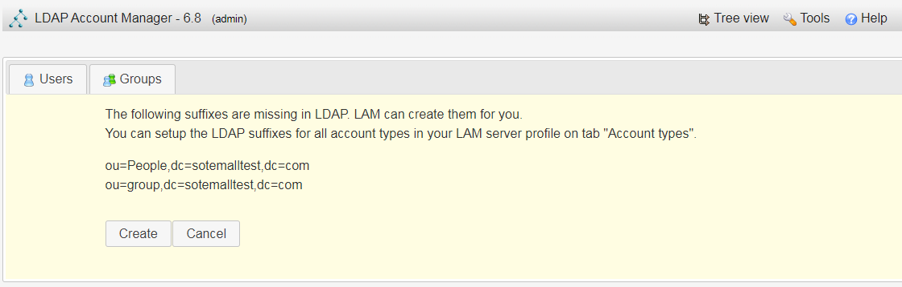

# ldap-manager-triangle


A docker image to run OpenLDAP and LDAPAccountManager





**installed docker-compose**

```bash
sudo curl -L "https://github.com/docker/compose/releases/download/1.24.1/docker-compose-$(uname -s)-$(uname -m)" -o /usr/local/bin/docker-compose

sudo chmod +x /usr/local/bin/docker-compose
sudo ln -s /usr/local/bin/docker-compose /usr/bin/docker-compose
```

Or Using pip install

```
pip install docker-compose
```


## Quick Start

Git clone Codes:

```bash
git clone https://github.com/swper/ldap-manager-triangle.git
cd ldap-manager-triangle
```

Lastly, run `docker-compose up` and Compose will start and run.

```
docker-compose docker-compose.yml up -d
```

The first startup will automatically pull the mirror, so it will be slow.


## Required image:

- docker pull osixia/docker-openldap

- docker pull ldapaccountmanager/lam

  

## Features:

- Quickly implement ldap services
- Docker method occupies less resources and is fast


# Documentation:

- The configuration profile for nginx, where the hostname of ldapaccountmanager/lam is specified

- lam.conf is change  ldapaccountmanager/lam service config.

- Modify the following configuration as appropriate

  ```yml
  #ServerURL is use docker-compose.yml services openldap. you can change dc service
  ServerURL: ldap://openldap:389     
  Admins: cn=Manager,dc=my-domain,dc=com
  treesuffix: dc=yourdomain,dc=org
  defaultLanguage: en_GB.utf8
  
  types: suffix_user: ou=People,dc=my-domain,dc=com
  types: suffix_group: ou=group,dc=my-domain,dc=com
  ```

- You must modify the following lines in the configuration file docker-composition.yml

  ```
  LDAP_ORGANISATION: "Your ORGANISATION"
  LDAP_DOMAIN: "Your DOMAIN"
  LDAP_ADMIN_PASSWORD: "Your Password"
  
  ```

  

- app.conf change your domain

  ```
  server_name  Your DOMAIN;
  ```

  

